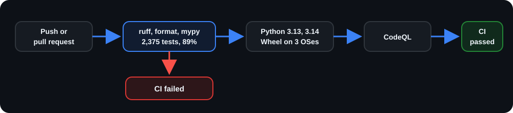

<div align="center">
<table><tr><td>
<pre>
  ____  _
 / ___|| |_   __ _   __ _   ___
 &#92;___ &#92;| __| / _&#96; | / _&#96; | / _ &#92;
  ___) | |_ | (_| || (_| ||  __/
 |____/ &#92;__| &#92;__,_| &#92;__, | &#92;___|
                    |___/
</pre>
</td></tr></table>

### One command. Thousands of internships.

**Stage reads 1,450+ employer boards, keeps the CS internships a Canadian or US undergrad can actually apply to**

No account, no server, no telemetry.

<br>


  [](https://github.com/NicholasXydis/Stage/actions/workflows/ci.yml)

<br>

<p align="center"><sub><b>Made with</b></sub></p>

<p align="center">
  
  &nbsp;&nbsp;&nbsp;
  
  &nbsp;&nbsp;&nbsp;
  
</p>

<p align="center"><sub><b>Works on</b></sub></p>

<p align="center">
  
  &nbsp;&nbsp;&nbsp;
  
  &nbsp;&nbsp;&nbsp;
  
</p>

</div>

## Why
Internships disappear fast. By the time you find the right posting, hundreds of students may already be ahead of you. Most job boards make it worse by burying relevant roles under senior positions, research jobs, and listings nowhere near you.

Stage scans 1,450+ employer career boards and finds internships CS undergrads in Canada and the U.S. can actually apply to. Every rejected posting is logged with the exact reason it was filtered out.

The last sync kept **2,500** postings out of **146,057**.

## Install

```bash
uv tool install stage-cli
```

<details>
<summary><b>Don't have uv?</b> Install it first, then reopen your terminal.</summary>

<br>

If you already have Python, this works everywhere:

```bash
pip install uv
```

Or use your usual package manager — `brew install uv` on macOS, `winget install
astral-sh.uv` on Windows. More options at
[docs.astral.sh/uv](https://docs.astral.sh/uv/getting-started/installation/).

</details>

<details>
<summary><b>Other ways to install</b></summary>

<br>

```bash
brew install NicholasXydis/tap/stage    # macOS and Linux
pipx install stage-cli                  # isolates the tool, like uv
pip install stage-cli                   # installs into the active environment
```

`uv tool install`, Homebrew, and `pipx` all keep Stage away from your system
Python, which is what you want for a command line tool.

</details>

Needs Python 3.12, 3.13, or 3.14. Nothing else to set up — no database to
configure, no API key, no config file.

### First run

```bash
stage sync                    # fetch every board once (grab a coffee)
stage tui                     # browse what came back
```

The first sync visits every board and takes a few minutes. Later ones are much
quicker, since Stage remembers what it already has and only asks each board for
what changed.

```bash
stage --install-completion    # tab-complete commands and filters
```

Completion needs a fresh terminal. After that, `stage <TAB>` lists commands and
`stage list --<TAB>` lists filters.

## The basics

```bash
stage sync                            # fetch the latest postings
stage list                            # what is new, newest first
stage search "machine learning"       # search titles, employers, descriptions
stage tui                             # browse it all in a full screen
```

Rows are numbered, so you can act on what you just saw:

```bash
stage list --role swe --location montreal
stage show 3                          # read the third row in full
stage open 3 5 9                      # open those three in your browser
```

Filters work the same on `list`, `search`, and `export`:

| Filter | What it takes |
| --- | --- |
| `--role` | swe, security, data, ml-ai, quant, infra, embedded, general-cs |
| `--location` | montreal, canada, usa, unknown |
| `--term` | summer-2027, fall-2026, winter-2027, and so on |
| `--lang` | en, fr, bilingual |
| `--source` | greenhouse, lever, ashby, workday, and more |
| `--company` | one exact employer |
| `--all` | every match, not just the first page |
| `--last N` | look back N days instead of the default 14; `--last 0` removes the limit. On `search`, which already covers every row, it narrows instead |

Mistype one and Stage tells you what it accepts, rather than showing you an
empty list.

## The full-screen browser

```bash
stage tui
```

Press `/` to search and `f` for filters — arrows move, enter picks, escape
closes. Role, location, language, how far back to look, new-since-last-sync, the
employer you are sitting on and your saved searches all live in that one panel.
`space` marks rows and `o` opens every one you marked. `w` expands the full
description, `e` exports what you are looking at, and `ctrl+t` changes the theme.
Press `?` for the full key list.

Same database and the same filters as the CLI, apart from `--source`. Row
numbers are a CLI idea — in the TUI you move a cursor instead.

## Keeping it fresh

```bash
stage schedule enable     # sync quietly in the background
stage schedule status     # check on it
```

Opt-in, and it uses whatever scheduler your system already has: launchd,
systemd, or Task Scheduler. Nothing runs until you turn it on.

Want to hear about new postings without checking? Point Stage at a Discord
channel you manage:

```bash
stage schedule notify https://discord.com/api/webhooks/...
stage schedule test-notify        # make sure it works
```

Create a Discord webhook in the channel you want Stage to post to. It is just a URL Stage uses to send new internships.

Notifications only follow scheduled syncs, not stage sync. Your machine also needs to be awake. If it misses runs, Stage catches up once when it can run again.

<details>
<summary><b>Want notifications around the clock?</b></summary>

<br>

Put Stage on something that stays on — a VPS, a Raspberry Pi, an old laptop:

```bash
uv tool install stage-cli
stage sync                         # first sync, a few minutes
stage schedule notify <webhook>
stage schedule enable              # systemd, launchd, or Task Scheduler
```

That machine keeps its own database and posts to Discord on its own schedule.
Yours stays free for browsing.

</details>

## Architecture

```text
Stage/
├─ src/stage/
│  ├─ cli/                  Typer commands, Rich rendering, scheduling, notify
│  ├─ tui/                  Textual screens over the same services; safe.py escapes output
│  ├─ sources/              13 ATS adapters + 11 curated feeds
│  ├─ services/             sync, discover, coverage, canary, health, export
│  ├─ classify/             role, internship scope, degree eligibility, location
│  ├─ normalize/            location, term, language, apply-url canonicalisation
│  ├─ dedup/                cross-source duplicate resolution
│  ├─ http/                 rate posture, circuit breaker, validator cache
│  ├─ storage/              SQLite repository, migrations, FTS
│  └─ data/                 packaged registry (a directory) and lexicons
├─ tests/                   2,319 tests, 89% branch coverage
└─ .github/workflows/       CI, CodeQL, scheduled canary, release
```

<div align="center">
<pre>
┌──────────────────────────────────────────────────────────────┐
│                    1,450+ employer boards                    │
│     Greenhouse · Lever · Ashby · Workday · SmartRecruiters   │
│              + 11 curated internship feeds                   │
└───────────────────────────┬──────────────────────────────────┘
                            │  rate-limited, cached, backed off
                            ▼
┌──────────────────────────────────────────────────────────────┐
│                          normalize                           │
│        location · term · language · canonical apply URL      │
└───────────────────────────┬──────────────────────────────────┘
                            ▼
┌──────────────────────────────────────────────────────────────┐
│                          screen                              │
│   internship? · CS role? · degree scope? · Canada or US?     │
│         every rejection keeps the rule that caught it        │
└──────────────┬───────────────────────────────┬───────────────┘
               │ kept                          │ rejected
               ▼                               ▼
        ┌─────────────┐                 ┌─────────────┐
        │    jobs     │                 │ quarantine  │
        │   2,500     │                 │  143,557    │
        └──────┬──────┘                 └─────────────┘
               │  dedup collapses the same posting across sources
               ▼
     ┌───────────────────────┐
     │   SQLite + FTS5       │
     │   on your machine     │
     └──────┬────────┬───────┘
            ▼        ▼
      stage list   stage tui
      search       full-screen browser
      export       Discord on a schedule
</pre>
</div>

## CI

| Workflow | File | Purpose |
| --- | --- | --- |
| CI | `.github/workflows/ci.yml` | Ruff, format, mypy strict, 2,319 tests, coverage floor, badge drift |
| Supported Pythons | `.github/workflows/ci.yml` | The full suite again on 3.13 and 3.14 |
| Wheel | `.github/workflows/ci.yml` | Builds and smoke-tests the wheel on Ubuntu, Windows and macOS |
| CodeQL | `.github/workflows/codeql.yml` | Static analysis for Python and the workflows themselves |
| Canary | `.github/workflows/canary.yml` | Probes one live board per platform and opens an issue on drift |
| Release | `.github/workflows/release.yml` | Re-runs every gate plus pip-audit, ready for a `v*` tag. Nothing is published yet |

<div align="center">
  
</div>

Any failing gate blocks the merge. The canary runs weekly and opens an issue
when a board changes shape, so parser drift surfaces before a sync does.

Every run also builds the wheel and installs it into a clean environment outside
the checkout on Ubuntu, Windows and macOS, checks the registry, lexicons and font
resolve from inside the installed package, then runs `help`, `list`, `search`,
`doctor`, `coverage`, `stats`, a dry-run sync and all four export formats against
it. What ships is what gets tested.

Stage is not published yet. `release.yml` is wired and rehearsed, but nothing
reaches PyPI until a `v*` tag is pushed.

## Good to know

- Everything sits in one SQLite file you own. Open it with any SQLite client,
  back it up, or delete it.
- The only network traffic is Stage reading public job boards. No account, no
  telemetry.
- Requests are rate limited per host, cached, and retried with backoff, so it
  does not hammer anyone's site.
- Four in five postings arrive with no description at all. Stage marks those
  fields `unknown` instead of guessing.
- Missing something you expected? `stage quarantine` shows which rule caught it.

## Learn more

`stage help` walks through the common workflows with real examples.
`stage help COMMAND` explains one command; `stage --help` lists them all.

[CHANGELOG.md](CHANGELOG.md) lists what changed in each release.

## Found a bug?

Open an issue, especially if a job board stopped working, since those break
without warning and I cannot watch all of them myself. I read everything.

## Security

Stage reads public job boards and writes to a local file. It never asks for
credentials. Found a security issue? Open a
[security advisory](https://github.com/NicholasXydis/Stage/security/advisories/new)
instead of a public issue.

## License

MIT. See [LICENSE](LICENSE).

<div align="center">
<br>
<sub>Built for students who would rather be studying than refreshing career pages.</sub>
</div>
